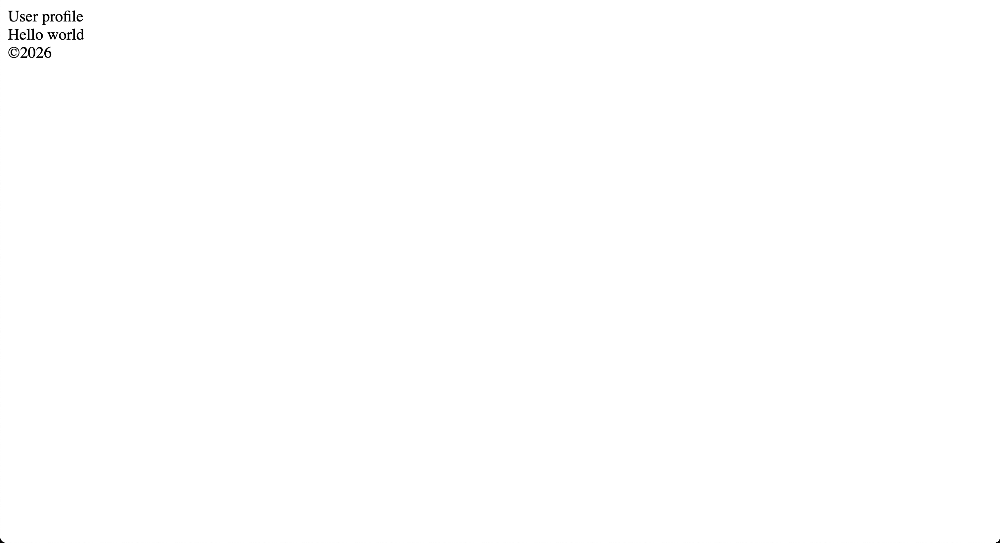

# 🟠 HTML Task 1 — Page Structure

### 🎯 Goal
Create a basic HTML page layout.

### 📦 Requirements
- Create a file called `app.html`
- Add a basic HTML structure:
    ```html
    <!DOCTYPE html>
    <html lang="en">
    <head>
        <title>Document</title>
    </head>
    <body>
    </body>
    </html>
    ```
- Change the page title from **Document** to **User profile**
- Inside `<body>` add:
    - `<header>` with text: **User profile**
    - `<main>` with text: **Hello world**
    - `<footer>` with text: **©2026**


### ✅ Expected result


